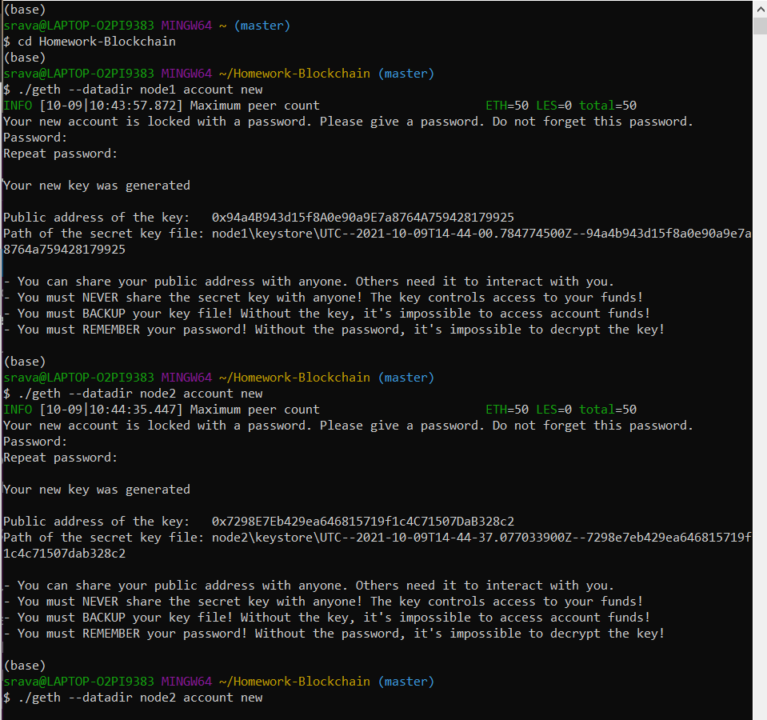
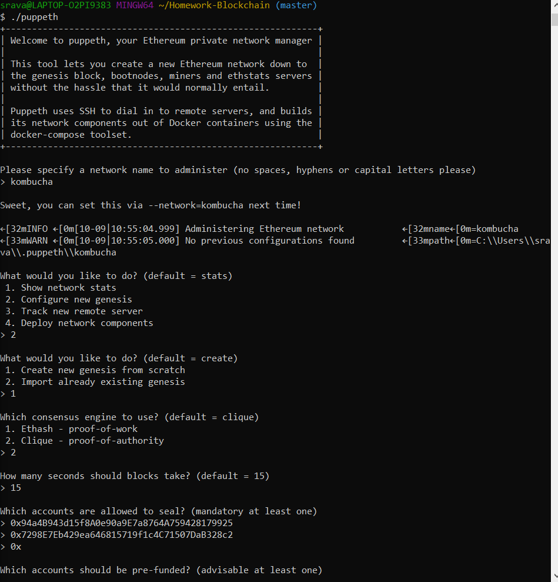
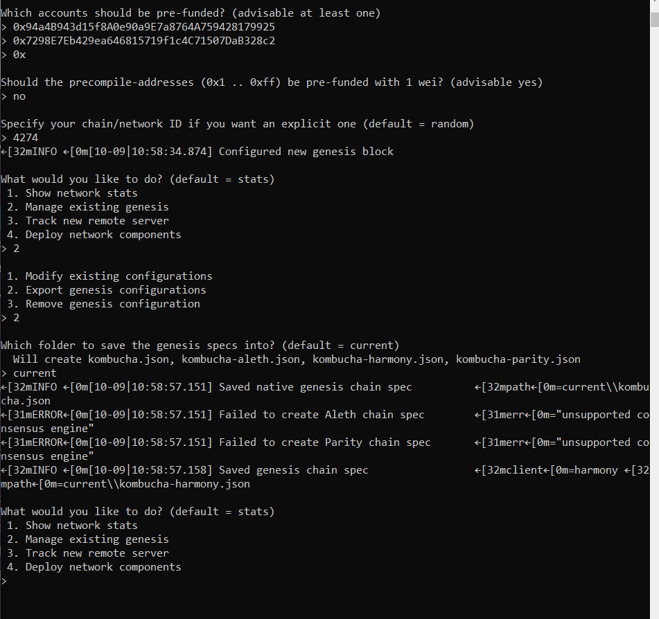
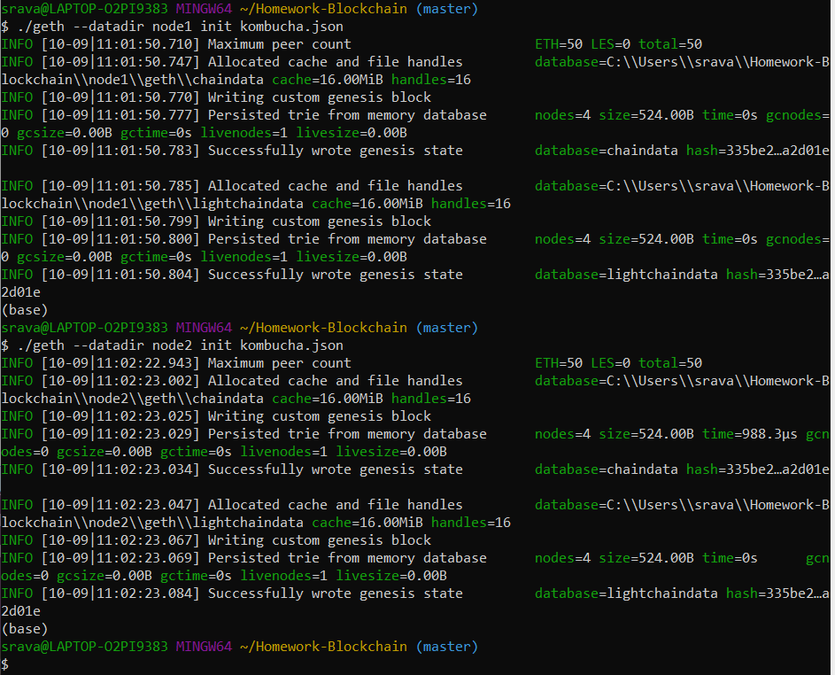
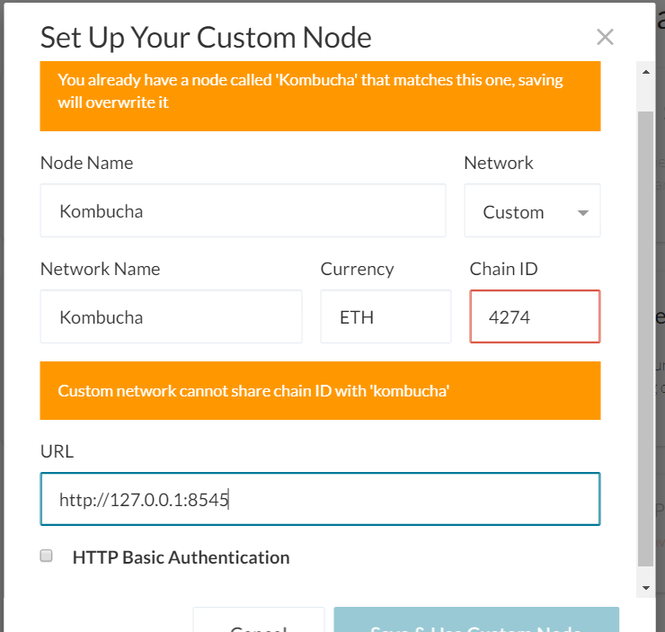
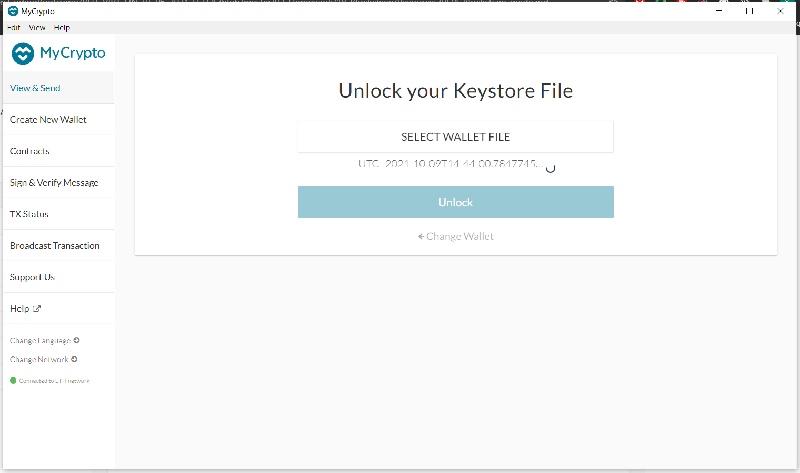
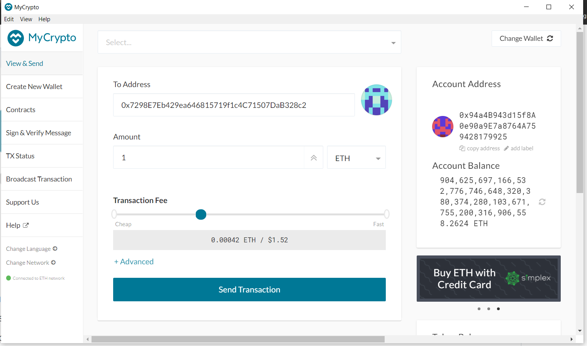
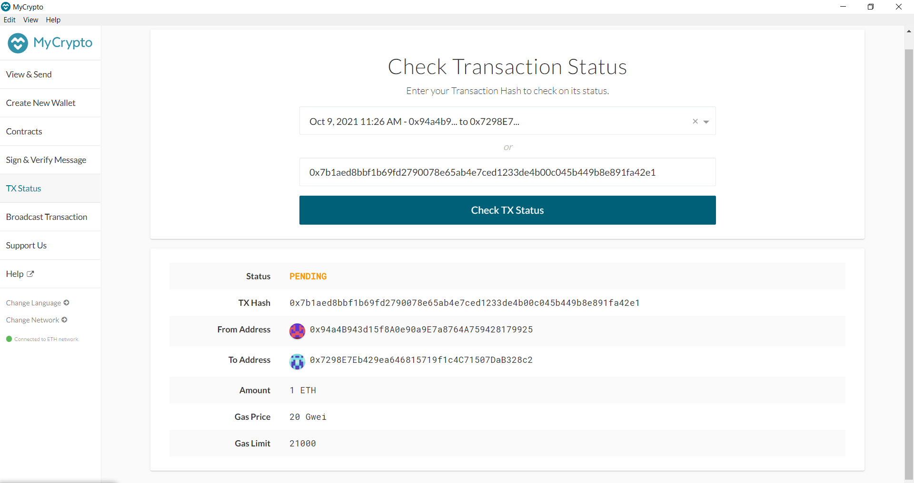

# Homework 18 - Blockchain

## Blockchain
A simple way to think about Blockchain is that it is a way to record information that cannot be changed, hacked or amended in anyway. 

A more formalized definition is that the blockchain is a digital ledger of transactions that all network participants on the block chain have a copy. As new transactions occur, the blockchain for all the participants will capture and add the record to the ledger. Each of these transactions are recorded with a hash, which is an immutable cryptographic signature. The machines that access the network (i.e. the participants' computers) are called nodes.

## ZBank Blockchain

### Initial Installs required
In order to set up the blockchain, there are a few installs we need to do.

1. Install MyCrypto Desktop

    From the MyCrypto website (https://download.mycrypto.com/), downlod the installer based on your operating system

2. Install Go Ethereum Tools

    a. From the Go Ethereum Tools download page (https://geth.ethereum.org/downloads/), install the "Geth & Tools 1.9.7" version

    b. After installing, you will need to unzip/decompress the file called "geth-alltools-windows-amd64- 1.9.7 - a718daa6.zip" file. The file should be decompressed in a location of your preference in your computer's hard drive. 

## Custom Testnet Blockchain Setup
Create a new project directory for your network. In this example, we named our Network "kombucha".

* For each instance of the terminal (Git Bash), we will need to open in "administrator" mode.

### Creating accounts and nodes

1. Open Git Bash and cd into the project directory folder
2. Use the datadir and geth commands to create accounts for two nodes

    * `./geth --datadir node1 account new`
    * `./geth --datadir node2 account new`

3. Make sure to save the Public address of the key and the Path of the secret key file for both nodes.

### Creating a Network and Configuring a new Genesis

1. in a new Git Bash terminal window, cd into the project directory folder
2. Run `./puppeth` in the command line
3. The first time to do is name your network! Make sure there are no spaces, hyphens or capital letters.
4. At the next prompt "What would you like to do?" select the Option 2. Configure new Genesis
5. At the "What would you like to do" prompt, select 1. Create new genesis from scratch. 
6. Once we see the "which consensus engine to use?", select 2. Clique - proof-of-authority
7. After selecting proof of authority, the answers to the next few questions should be:

    * How many seconds should blocks take? 
    
        Let's type in the default value of 15
    * Which accounts are allowed to seal?

        Copy the public address of node 1 (everything after the beginning two characters of "0x") and paste into the command line.
        
        A second line will display and copy the public address of node2 and paste into the command line. 

        

    * Which accounts should be pre-funded?

        Paste node1 and node2 public addresses to prefund the accounts.

    * Should the precompile-addresses be prerefunded with 1 wei? 

        No

    * Specify your chain/network ID if you want an explicit one

        You can pick a random set of numbers, just be sure to note these down. This will be important to configure the network in MyCrypto App. 

    * What would you like to do?
    
        Select Option 2. Manage existing genesis.

        at the next prompt, select 2. Export genesis configuration.

    *The next step will ask the blockchain creater which folder to save the genesis specs. The default value would be the current folder. Two `.json` files will be created. We only need to keep the `kombucha.json` file.

### Initializing each node

1. Use geth to initialize the nodes created above in the genesis json file with the following commands:

    * `./geth --datadir node1 init kombucha.json`
    * `./geth --datadir node2 init kombucha.json`

** For this next step, we will need to open one additional terminal window so we can activate the two nodes in separate windows. 

### Mine blocks

1. Run the following command in the initial window:
    
    * `./geth --datadir node1 --unlock "SEALER_ONE_ADDRESS" --mine --rpc --allow-insecure-unlock`

        * The above 'Sealer_one_address' should be the first public address for node 1.

            Example: `./geth --datadir node1 --unlock "0x94a4B943d15f8A0e90a9E7a8764A759428179925" --mine --rpc --allow-insecure-unlock`

2. In the new window that was opened, run the following command to initiallize the second node: 

    * `./geth --datadir node2 --unlock "SEALER_TWO_ADDRESS" --mine --port 30304 --bootnodes "enode://SEALER_ONE_ENODE_ADDRESS@127.0.0.1:30303" --ipcdisable --allow-insecure-unlock`

        * Sealer_two_address will be node2's public address. The enode:// can be found in the terminal where we initialized the first node.

            Example: `./geth --datadir node2 --unlock "0x7298E7Eb429ea646815719f1c4C71507DaB328c2" --mine --port 30304 --bootnodes "enode://f21b1c5a454fc491ee7d28baa690249946cd8fed1d15cd1d107b77ef31a24b1ef9f820173cf327fa2090508ea9e874af40b1e4e4674b339ab31d37fa4c0e1c34@127.0.0.1:30303" --ipcdisable --allow-insecure-unlock`

### Connect the private PoA blockchain with MyCrypto

1. Open the MyCrypto App and navigate to the "Change Network" option on the bottom left of the window
2. Scroll down to "+Add Custom Node"
3. You will need to enter the following information to set up the node:
    * Node Name: This is the name created in the initial puppeth step. My node is called Kombucha
    * Network: This should be set to "Custom"
    * Network Name: This value should be the same as the Node Name
    * Currency: Set to ETH
    * ChainID - this is the chainID value specified in genesis creation
    * URL: this identifies the default RPC port on your local machine.

4. Save & Use Custom Node

### Send transaction
1. Access the wallet by using the "Keystore File"
2. Select the "Wallet File" and nagivate to the keystore directory inside Node1. This will import the private key. 

3. Once MyCrypto accepts the private key, the app will launch to a transaction page. 

4. Now, it's time to send a test transaction from Node 1 to Node 2. 

    * In the "To Addresss", paste the public address of node 2. Specify the amount to send and send the transaction. (See above screenshot as example)

5. Once we click "Send Transaction", a transaction hash will pop up. Copy this value and navigate to the TX Status Section in the app. 

6. Once in the "Check Transaction Status" page, paste the transaction hash and check TX Status. 

